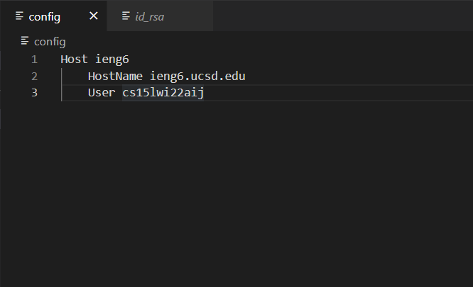
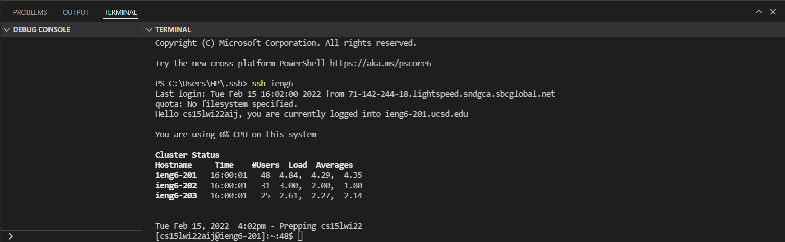
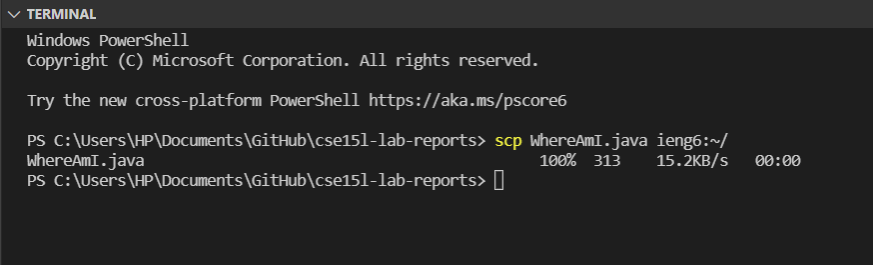

## Streamline `ssh` Configuration
Everytime I log into `ieng6` from my laptop, I need to type
`ssh cs15lwi22aij@ieng6.ucsd.edu`
So, I created a configuratio files that can save my typing time. 

First I created an configuration file with the hostname and my username.

After adding this file I can simply type `ieng6` in the command to log in.

Then I can copy file to my account using just the alias that I chose. The example below is when I want to copy `WhereAmI.java`
