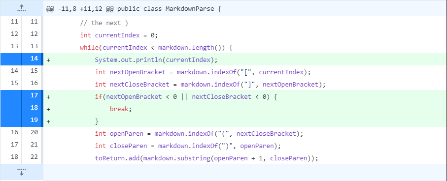
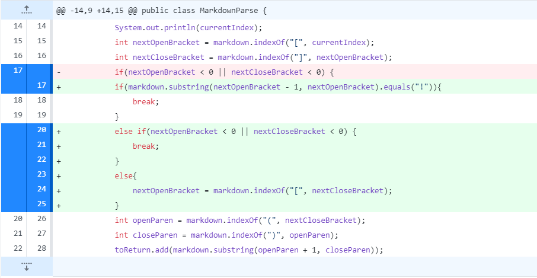
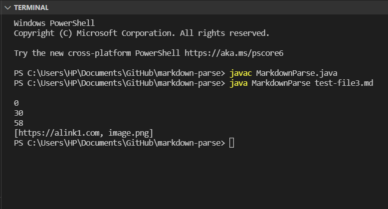

## First Code change
---
**Screenshoot of code change**

The screenshot below shows the change of `MarkDownParse` code. 
We added a line to printout the `currentIndex` and causes a infinite loop.

**Link to the test file**

We added several empty lines in [test file 2](https://github.com/tiarahe2002/markdown-parse/blob/main/test-file2.md).  
And the output looks like:

Because the empty lines will cause the `currentIndex` be less than the length of file so that the while loop is non-stop and keep print out the `currentIndex`. In order to fix this infinite bug, we set a `if` condition so if system didn;t find any more brackets or parentheses after the last closed bracket, the loop will break.

## Second Code change
---
**Screenshoot of code change**

The screenshot below shows the second change of `MarkDownParse` code. 

**Link to the test file**

We added an image link in [test file 2](https://github.com/tiarahe2002/markdown-parse/blob/main/test-file2.md). This image link should not appear on the output.
But the output looks like:

Because the original code get the link according to the position of brackets and parentheses. But an image link contains the same format. The only difference is an image link has "!" before the brackets. So we added an `if` condition to check the "!" before the brackets.
