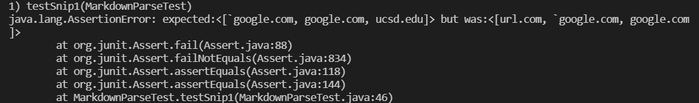
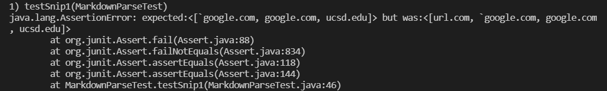
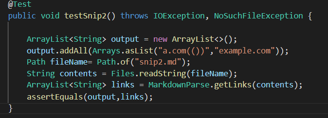
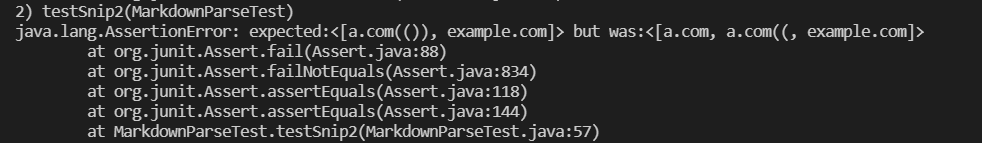
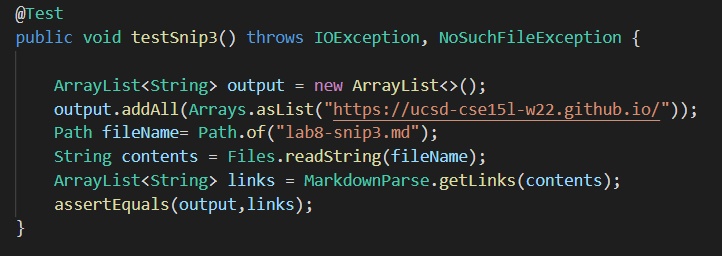
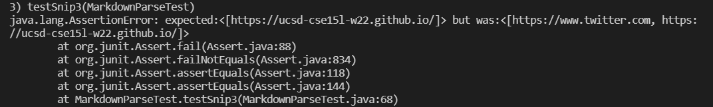
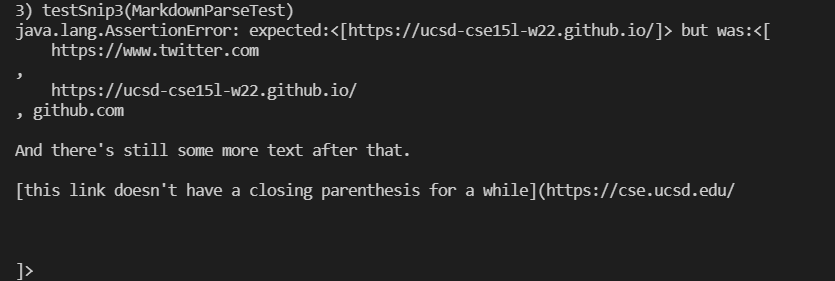

[Here's](https://github.com/mBookUCSD/markdown-parse/blob/main/MarkdownParse.java) our group's MarkdownParse repository.

[This](https://github.com/sallada1/markdown-parse) is the repository we viewed.

## Snippet 1
For this snippet, the correct output should be
`[google.com,google.com,ucsd.edu]`

Here is how I tested:

Test for our group's MarkdownParse:

Change work for snippet 1:
I think a small code change will work for snippet 1. We need to add a if statement to find a backtick and skip it before identifying a bracket.

Test for other group's MarkdownParse:

## Snippet 2
For this snippet, the correct output should be
`[a.com,a.com(()),example.com]`

Here is how I tested:

Our group's MarkdownParse was passed for second snippet;

Test for other group's MarkdownParse:

## Snippet 3
For this snippet, the correct output should be
`[https://ucsd-cse15l-w22.github.io/]`

Here is how I tested:

Test for our group's MarkdownParse:

Change work for snippet 3:
I don't think a small code change will work for snippet 3. Since there are a variety of different parentheses, brackets, and spaces. We probably need to rewrite our code. 

Test for other group's MarkdownParse:

